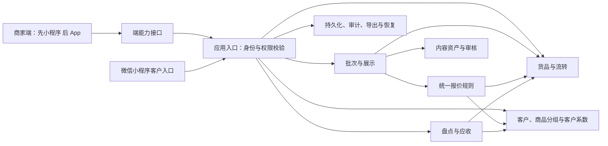

# 架构与模块实现路径

日期：2026-09-23。状态：**D-01、D-03、D-04、D-05、D-07 的已确认部分已开始实施；D-02、D-06、D-08 等真实接入或后续能力仍按各自阻塞边界处理**。依据：[说明书](00-project-definition-v1.1.md)；决策编号见 [待确认事项](01-decisions.md)。

## 1. 系统形态

从一个 TypeScript 单体服务开始，PostgreSQL 持久化。客户入口和商家端第一阶段均使用 uni-app、Vue 3、TypeScript 编译为微信小程序。商家端业务页面、状态与校验保持平台无关，后续扩展 App；相机、视频、扫码、本地文件和未来硬件通过窄的端能力接口接入。第一阶段只实现小程序适配器，不预建空 App 工程或空硬件插件。本地阶段媒体写入受控本地目录，存储边界保留以后替换对象存储的能力。

不设置独立微服务、独立搜索服务或额外消息基础设施。模块间优先直接调用；可靠性、事务与数据约束先由确认后的应用和持久化能力承担。未来只有测量证明单体不足时再讨论拆分，不在本轮增加其他技术栈。

## 2. 模块清单

以下路径均为**拟建目录**，目前不存在。`app/` 是逻辑源码根占位名；D-01 确定后按既有框架目录规范映射，并更新此表，不同时创建两套目录。

| 模块 / 拟建路径 | 职责与拥有的数据 | 边界与依赖 | 实现顺序与完成路径 |
|---|---|---|---|
| B 基础权限 `app/access/` | 档口、员工身份、角色、权限、客户身份映射、停用、会话 | 决定可访问档口与字段；不计算价格；所有模块依赖它 | 最先：本地测试身份 → 员工登录/停用 → 客户身份绑定 → 跨档口与字段越权检查；覆盖 F-11 |
| G 货品与流转 `app/goods/` | 货号、属性、证书、位置、权属、业务状态、借还与经手记录 | 不直接向客户输出内部档案；引用内容资产；所有状态更新经过本模块 | 唯一货号与图片视频关联 → 基础检索 → 状态变更并发控制 → 借还、期限及责任追踪；覆盖 F-5/6/7/10 |
| C 客户与分组 `app/customers/` | 档口客户、多个商品可见分组、单客商品授权、客户价格系数、跟进与拿货记录 | 商品分组和单客授权只控制可见性；客户系数只控制报价；标签系统后置 | 建档 → 商品组/单客授权/客户系数 → 身份映射 → 跟进 → 授权导出；覆盖 F-4 |
| P 统一定价 `app/pricing/` | 挂牌价、成本价、最低可售价、客户系数、单客单品修正价、价格版本 | 唯一报价来源；依赖客户/货品和权限；界面不得自行计算或绕过最低价 | 三项商品价格 → 客户系数 → 最低价兜底 → 单客修正 → 改价生效；覆盖 F-13、F-5/10/11 价格部分 |
| M 内容资产 `app/media/` | 原始媒体、展示版本、所属档口、审核状态、大小与使用量 | 未通过审核不可外显；访问先鉴权；不含品质鉴定、平台代运营 | 图片+视频上传 → 审核与拒绝 → 授权展示/按需加载 → 追溯标识、撤销与历史保留；覆盖 F-12、C-3/6 |
| S 批次与看款 `app/publishing/` | 批次、成员、发布记录、受众规则、分享入口、访问与询价留痕 | 编排 G/C/P/M；必须先判断货品可见性再求价；分发由老板在自有渠道完成 | 批量选货 → 审核/授权检查 → 发布 → 客户列表/筛选/详情/联系老板 → 历史和撤销；覆盖 F-1/2/3、客户侧 F-7 |
| I 盘点 `app/inventory/` | 盘点范围、账面快照、实盘记录、差异、复核与责任 | 读 G 的账面与变更记录；盘点差异不自动覆盖实时库存，不直接执行出库 | 发起盘点 → 人工录货号 → 差异清单 → 复核确认；覆盖 F-8 |
| R 应收对账 `app/receivables/` | 应收、期限、线下收款记录、核销、冲销、对账单 | 引用客户/货品；金额来自人工确认的实际交易记录，不随展示价重算；不触碰资金 | 应收 → 部分/全部核销 → 账龄 → 对账单生成与人工交付留痕；覆盖 F-9 |
| O 运行与数据交接 `app/operations/` | 操作审计、授权导出记录、备份恢复记录、必要运行指标 | 审计随写操作发生；不创建重复业务账本；备份和导出目的不同 | 最先提供事务审计 → 老板一键导出 → 备份/恢复验证 → 成本与运行观测；覆盖 C-2/5 和各模块追溯 |
| 两类界面 `app/staff/`、`app/showroom/` | 工作台操作与客户只读展示/询价入口 | 界面不能绕开 B/P；展示接口不包含多档价格或内部成本；不得靠隐藏按钮实现授权 | 手机可操作的闭环 → 弱网草稿 → 角色界面与低门槛输入；对应 S-1 至 S-7 |
| 端能力 `app/platform/` | 相机、视频录制、扫码、本地文件/草稿及未来硬件的最小能力契约与平台适配 | 业务模块只依赖能力契约；第一阶段仅实现真实使用的小程序适配器；网络请求、普通 UI 不为跨端重复包装 | 随 T1 能力逐个增加小程序适配器 → 真机验证 → App 阶段补原生插件；对应 C-8/E-5 的演进边界 |

## 3. 写入边界与依赖规则

每个模块只修改自己拥有的数据；跨模块动作由应用入口编排并执行必要的原子提交。优先在同一应用内完成，不能用“最终一致”掩盖货物状态、价格或权限的错误。

- 建货时由 G 建档，M 保存媒体并返回资产引用；成本和售价通过 P 写入，G 只保留关联。上传未完成或审核未通过不阻止保存内部草稿，但阻止外部发布。
- 发布时 S 读取 G 的可展示状态、M 的审核状态和 C 的受众；提交批次和发布记录。后续每次查看仍要校验当前授权、当前审核状态与当前报价，不能只在发布时校验。
- 改价由 P 校验权限并记录审计。单客单品修正价优先于客户系数计算，但最终数字价始终不低于最低可售价。报价使用当前版本；所有依赖旧版本的展示结果必须失效。
- 员工权限由老板从固定权限项中配置；B 在服务端执行，界面隐藏不能替代鉴权。新增员工默认无权限，权限和敏感字段变更留痕。
- 出库/借出由 G 同时更新状态、位置/经手信息、借还记录和审计；任何部分失败，整次业务变更不成功。
- 账号停用由 B 使已有会话失效；C/G 的归属仍是档口。客户、货品、操作记录不可随员工删除。
- I 发现差异后交给有权限的人员复核，需要改状态时走 G 的正常入口；R 核销只修改账目，不自动改变货物状态。
- O 的导出遵循角色权限；备份由运维授权访问，不提供给普通员工。导出不能被当作绕过字段权限的通道。

## 4. 主要数据流

**一次录货到客户看款**：员工登录 → 保存草稿并上传媒体 → 审核通过 → 填写三项价格、无门槛开关及可见商品组 → 发布 → 访客看名片和无门槛商品 → 客户授权手机号 → 商家设置商品组、单客商品授权和客户价格系数 → 可见集合取无门槛、所属各组及单客授权商品的并集 → 对可见商品按独立定价规则输出报价。

商家的“分组”是本系统中的商品可见分组，不是微信聊天群。商品组及单客商品授权决定看什么，客户价格系数决定看什么价格，两者不互相推导。MVP 不实现标签系统。

**没有可信客户身份时**：只看商家名片和无门槛商品。**已识别但没有商品组或单客授权时**也只看无门槛商品；**没有客户系数时**对可见商品使用挂牌价。单独发送商品只增加可见性，不自动产生特殊价格。

**货物借出到归还**：选货 → 校验最新版本和合法状态 → 记录对象、责任人、时间、期限 → 提交借出及审计 → 到期清单 → 对应原借出记录归还 → 状态和位置更新。提醒首先表现为工作台清单；外部主动通知待渠道规则与授权验证。

**线下成交到对账**：员工记录售出事实 → 有权限人员单独确认应收和到期日 → 记录线下已收款 → 原子核销 → 按客户及截止日生成对账单 → 老板自行交付并记录时间。不得调用支付或分账服务。

## 5. 对外与内部边界

- 员工入口、客户入口分开定义请求和返回字段；同一个实体不应直接序列化给所有角色。
- 搜索与筛选也必须在可见范围内执行；客户按价格筛选只能使用其有效报价，不能通过排序、计数或错误响应推断隐藏档位。
- 客户价格禁止共用公开缓存；媒体原始地址不能成为绕过权限的长期公开通道。采用何种交付机制由 D-01/02 决定，并验证撤销后的实际效果。
- 分享口令/链接是访问资源，不等于身份证明；微信身份和手机号渠道已由用户指定，接入资格与实际能力待核验；媒体服务与证书查询连接尚未确定，不预建 SDK 包装层。
- 所有业务数据含档口归属；身份上下文决定档口与客户，不能信任调用者自行传入的归属。每个读取、写入、导出与媒体下载均校验。
- 防外泄是权限限制、追溯与操作约束的组合；无法收回已经被拍照或记住的信息。已展示内容与未来服务端访问撤销必须分别说明。

## 6. 范围追踪

| 业务能力 | 实现模块 | 最迟阶段 |
|---|---|---|
| F-1/2/3 批次、看款、可见范围 | S + B/P/M/G/C | T2 私域试用；基础闭环在 T1 |
| F-4 客户档案、商品分组与客户系数 | C + B/O | T2；基础模型在 T1 |
| F-5/6/7 货档、状态、筛选 | G + P/M/S | T3；基础货档在 T1 |
| F-8 盘点 | I + G/O | T3 |
| F-9 应收对账 | R + C/G/O | T3 |
| F-10/11 归属责任与权限 | G + B/P/O | T3；权限从 T1 开始 |
| F-12 内容资产 | M + O | T2；图片视频在 T1 |
| F-13 客户系数与单客报价 | P + C/B/S | T2；三项商品价格和客户系数在 T1 |

阶段定义和完整验收见 [开发路线图](04-roadmap.md)。阶段拆分只决定先后，不取消说明书中的必须功能。
